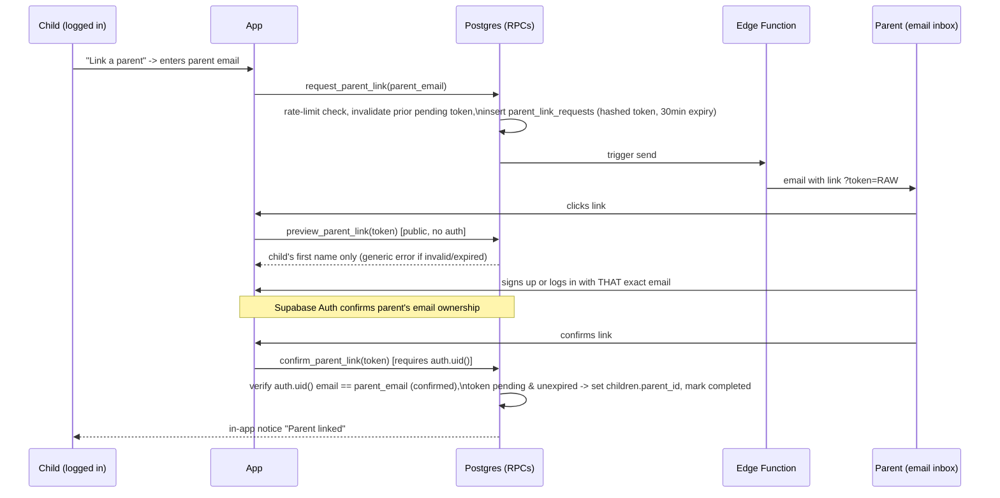

# Child-Initiated Parent Linking — Design

Status: **Migration + RPCs implemented on Supabase project `rsiupmbfhqtihmtahccg`.
Email sending (Resend), Next.js API routes, and UI are not built yet.**
Owner: Rowil
Last updated: 2026-08-05

## Background

Today `children.parent_id` is a `NOT NULL` foreign key to `parents.id` — a child
profile cannot exist, and cannot log in (`verify_child_login` joins to
`parents` and requires `status = 'approved'`), without an approved parent
account created first. This forces every child to wait on an adult completing
Supabase Auth signup + admin approval before they can play, which alienates
kids whose parents haven't set anything up yet.

Goal: let children self-register and play immediately (reusing the
`create_demo_account` pattern, which already proves an `auth.users` identity
can own game state with zero `parents` dependency), and let a parent attach
to that child's profile **afterward** via a link the child themselves
initiates — never the reverse, so a stranger can't "claim" an existing child
by just creating a parent account and searching for them.

## Threat model

The attack this design defends against: someone who has (or guesses) a
child's username + PIN uses that access to attach *themselves* as the
child's parent, gaining parent-level visibility (PIN visibility RPC,
progress dashboard, etc.) over a child that isn't theirs.

Two independent proofs are required before a link completes:

1. The link request came from someone who controls the child's login
   (child-initiated, authenticated as the child).
2. The account being linked controls the invited parent email address
   (Supabase Auth email confirmation).

Neither proof alone is sufficient — a compromised PIN alone can't complete a
link (still needs to confirm an email), and owning an email alone can't
initiate a link (no parent-side "claim a child" flow exists at all).

## Prerequisites (must ship before this feature is safe)

1. **Rate limiting / lockout on `verify_child_login`.** It currently has
   none — `app/api/child-login/route.ts` calls the RPC directly with no
   attempt counting. A 4-digit PIN (10,000 combinations) with unlimited
   attempts is the actual weak point this whole feature would otherwise
   inherit. **Decided: 3 failed attempts → 15-minute lockout, scoped per
   child id** (not per IP, so siblings on one household connection don't
   lock each other out), mirroring the sliding-window pattern already used
   by `create_demo_account` (`demo_rate_limit`).
2. **A transactional email provider.** The repo currently only has SendFox
   (marketing list sync, via `supabase/functions/sendfox-sync` and
   `reengagement-sync`) — no Resend/SendGrid/Postmark/SMTP anywhere, and no
   customized Supabase Auth email templates. **Decided: Resend** (simple
   REST API, generous free tier, easy to call from a Deno Edge Function via
   plain `fetch`). Requires creating an account + API key before
   implementation starts.

## Flow



## Schema changes

```sql
-- children.parent_id becomes nullable to allow self-registered,
-- not-yet-linked child accounts.
alter table children alter column parent_id drop not null;

create table parent_link_requests (
  id uuid primary key default gen_random_uuid(),
  child_id uuid not null references children(id),
  parent_email text not null,              -- lowercased/trimmed before insert
  token_hash text not null,                -- sha256(raw token); raw token never stored
  status text not null default 'pending',  -- pending | completed | expired | revoked
  attempts int not null default 0,         -- preview_parent_link calls, for abuse detection
  created_at timestamptz not null default now(),
  expires_at timestamptz not null default now() + interval '30 minutes',
  completed_at timestamptz
);

create index parent_link_requests_pending_child_idx
  on parent_link_requests (child_id)
  where status = 'pending';
```

## RPCs

All `SECURITY DEFINER`. All failure paths return the same generic error
message per RPC — no distinguishing "expired" vs "invalid" vs "already used"
— to prevent enumeration and timing attacks.

### `request_parent_link(p_parent_email text)`

- Requires `auth.uid()` to resolve to the calling child via
  `user_identity_map`.
- **Rejects outright if `children.parent_id` is already set** — a linked
  child cannot be re-linked to a different email through this flow at all.
  Changing an existing link is a support/admin operation, not a
  self-service one (decided: block outright, no veto-window flow).
- **Rate limited: 3 requests per day per child, and 3 per day per target
  email address** (the per-email limit stops a compromised PIN from being
  used to spam a stranger's inbox repeatedly), sliding window, same shape as
  `create_demo_account`'s rate limit.
- Invalidates any existing `pending` request for this child first — only
  one active invite per child at a time.
- Generates a random 32-byte token, stores `sha256(token)` (raw token never
  touches the DB or logs), calls the Edge Function to send the email.

### `preview_parent_link(p_token text)`

- Public — no auth required (the parent hasn't signed in yet when they
  click the emailed link).
- Takes the raw token, hashes it, looks it up.
- Returns `{ child_first_name }` only if `pending` and unexpired.
- Otherwise returns one generic "invalid or expired link" error for every
  failure case.

### `confirm_parent_link(p_token text)`

- Requires `auth.uid()`.
- Re-validates the token (`pending`, unexpired).
- **Hard requirement:** `auth.users.email` (lowercased) must exactly equal
  the stored `parent_email`, and `email_confirmed_at is not null`.
- Ensures a `parents` row exists for `auth.uid()` (creates if missing).
- Sets `parents.status = 'approved'` immediately (decided: auto-approve —
  a child-initiated + email-confirmed link is stronger proof than today's
  blind parent self-registration, so no admin queue).
- Sets `children.parent_id`, marks the request `completed`, **credits 100
  gold to the child's currency balance**, all in the same transaction
  (atomic — no double-consumption race, no partial reward on failure).

## Feature gating: unclaimed vs. linked child accounts

An unclaimed child (self-registered, no `parent_id` yet) needs *some* gate,
both to give families a reason to eventually link and to bound the
oversight-free surface (unmoderated kids interacting with strangers) while
unlinked.

- **Available immediately, no parent required:** core single-player
  gameplay, progress saving, cosmetics/shop purchases with earned currency.
- **Gated until linked:** leaderboards and PvP — same boundary the existing
  demo-account system already draws ([project_public_demo_account.md]).
  Parent-facing tools (PIN-visibility RPC, progress dashboard) are
  irrelevant to an unclaimed child by definition — there's no parent to use
  them yet.
- **Incentive, not a hard wall:** an in-app nudge banner ("Link a parent and
  earn 100 gold + unlock leaderboards!") surfaces after some play threshold
  (e.g. day 3, or first attempted PvP entry) rather than blocking core
  gameplay outright — preserves the original goal of not alienating kids
  whose parents haven't linked yet.
- Successful linking pays out **100 gold** (see `confirm_parent_link`
  above), which the nudge banner should advertise up front.

## Admin re-link tool

Re-linking a claimed child (moving `parent_id` from one parent to another)
is a rare, high-trust support action — e.g. a parent lost access, or a
family/guardianship change — and must never be self-service (see "Block
outright" decision above). The existing admin dashboard
(`app/tatayadmin` → `components/admin/ChildrenSection.tsx`) currently only
supports toggling `is_active` on a child and displays `parent_id` read-only;
there's no reassignment path today.

**Design: admin-initiated with a 48-hour objection window before it takes
effect**, not an immediate reassignment.

1. Admin action: `admin_request_child_reassignment(child_id, new_parent_email, reason)`.
   - Gated the same way as other sensitive admin RPCs — passcode-protected
     API route (`lib/adminAuth.ts` `requireAdminPasscode` pattern), not just
     the client-side `NEXT_PUBLIC_ADMIN_EMAIL` check `ChildrenSection.tsx`
     currently relies on for its other actions.
   - `reason` is required free text — no silent reassignment.
   - Inserts a row into `pending_parent_reassignments` (child_id,
     old_parent_id, new_parent_email, reason, admin_id, created_at,
     effective_at = now() + 48h, status = 'pending').
2. Immediately emails the **old (current) parent** a notice with a one-click
   **cancel** link, and separately notifies the **new parent** that a
   transfer has been requested and won't complete for 48 hours.
3. If the old parent clicks cancel: status → `cancelled`, nothing changes.
4. If unclicked after 48 hours: a scheduled job (same cron pattern as
   `reengagement-sync`, `x-cron-secret`-gated) executes the reassignment —
   sets `children.parent_id` to the new parent, status → `completed` — and
   emails both parties confirming the change took effect.
5. Full audit trail: every request, cancellation, and completion is a row
   in `pending_parent_reassignments`, permanently retained (no deletes).

## Hardening checklist

- [ ] Token stored hashed only (`sha256`); raw token exists only in transit
      (RPC return value -> Edge Function -> email), never logged.
- [ ] One pending invite per child at a time; new request invalidates the
      old one.
- [ ] Rate limits on `request_parent_link` (per child, per target email).
- [ ] Rate limit / lockout on `verify_child_login` PIN attempts (see
      Prerequisites).
- [ ] `preview_parent_link` and `confirm_parent_link` return identical
      generic errors for all failure modes.
- [ ] Audit log row (child_id, parent_email, ip, user-agent, outcome) on
      every request/confirm call, matching the existing `analytics_events`
      pattern used in `demo-login`.
- [ ] 30-minute token expiry.
- [ ] Single-use token, consumed atomically with the `parent_id` update.
- [ ] Re-link blocked outright once `children.parent_id` is set — the only
      path to change a set `parent_id` is the admin re-link tool below.
- [ ] Admin re-link tool is passcode-gated, requires a reason, and always
      goes through the 48-hour objection window (no instant-execute path).

## Decisions made

| Question | Decision |
|---|---|
| Email provider | **Resend.** |
| `verify_child_login` PIN lockout | **3 failed attempts → 15-minute lockout, per child id.** |
| `request_parent_link` rate limit | **3 per day per child, and 3 per day per target email.** |
| Auto-approve parent on successful link, or require admin review? | **Auto-approve.** Child-initiated + email-confirmed is stronger proof than today's blind self-registration. |
| What happens if an already-linked child requests a new link to a different email? | **Block outright.** Re-linking a claimed child requires support/admin intervention, not a self-service flow. |
| Reward for linking | **100 gold**, credited atomically in `confirm_parent_link`; advertised in the nudge banner. |
| Feature gating for unclaimed children | **Full single-player + shop immediately; leaderboards/PvP gated until linked** — mirrors the existing demo-account boundary. Nudge banner, not a hard wall. |
| Admin re-link mechanism | **48-hour objection window.** Old parent gets a cancel link; new parent is notified a transfer is pending; a scheduled job executes it if not cancelled. Full audit trail, no instant reassignment. |

## Implementation notes (2026-08-05)

Applied as five migrations on the remote Supabase project directly (no
`supabase/migrations` directory in this repo — DB changes are tracked only
on the remote instance, consistent with how the rest of the schema is
managed here):

1. `add_child_login_lockout` — `child_login_failures` table;
   `verify_child_login` / `link_verified_identity` rewritten for the 3/15min
   lockout and to allow `parent_id IS NULL` logins.
2. `add_unclaimed_child_accounts` — `children.parent_id` made nullable;
   `child_signup_rate_limit` table; **`create_unclaimed_child_account`
   RPC** (not explicitly specced above, but required — without it no
   unclaimed child could ever exist to link. Modeled on
   `create_child_account` + `create_demo_account`, IP-rate-limited 5/hour,
   real username+PIN, no parent required).
3. `add_parent_link_requests` — the table and the three RPCs exactly as
   specced above.
4. `add_admin_child_reassignment` — `pending_parent_reassignments` table,
   `admin_request_child_reassignment`, `cancel_child_reassignment`,
   `execute_due_child_reassignments`.
5. `gate_execute_due_child_reassignments` — **security fix.** The advisor
   flagged `execute_due_child_reassignments()` as callable by the `anon`
   role with no internal check at all, which would let anyone force-execute
   a pending reassignment early and skip the 48h objection window entirely.
   Added a dedicated secret (`reassignment_cron_secret` table,
   `check_reassignment_cron_secret`), separate from both the admin passcode
   and `CRON_SECRET`. The zero-arg version briefly existed as an
   **unguarded second overload** after a `create or replace` with a
   different signature (the exact overload trap noted in project memory)
   and was dropped explicitly — verified via `pg_proc` that only the
   guarded `(p_cron_secret text)` signature remains.

Verified via `get_advisors` + direct RPC calls: all new tables have RLS
enabled with no policies (matches the `demo_rate_limit` convention — only
reachable through `SECURITY DEFINER` functions); every RPC rejects invalid
input with its intended generic error; the PIN lockout trips on the 4th bad
attempt.

**The `reassignment_cron_secret` plaintext was surfaced once at seed time
and is not recoverable from the stored hash. Save it now as an env var
(e.g. `REASSIGNMENT_CRON_SECRET`) for whichever scheduled job ends up
calling `execute_due_child_reassignments` — it was shared with you directly
in chat, not committed anywhere.**

## Implementation notes, continued (2026-08-05)

Deployed `supabase/functions/request-parent-link/index.ts` (verify_jwt:
false, matching `sendfox-sync`'s convention of doing its own
`auth.getUser()` check in-function) — the child's client calls this with
`{ parentEmail }` and their JWT; it calls `request_parent_link` scoped to
the caller's own session, looks up the child's first name, and sends the
invite email via Resend. The raw token exists only inside this function's
execution and is never returned to the browser.

Needs two more secrets set alongside `RESEND_API_KEY` (Project Settings →
Edge Functions → Secrets) before it's actually usable in production:
- `SITE_URL` — production domain; falls back to `http://localhost:3000`.
- `RESEND_FROM_EMAIL` — falls back to Resend's shared test sender
  (`onboarding@resend.dev`), which only delivers to the Resend account
  owner's own inbox. Real parent invites need a verified sending domain in
  Resend first.

Not yet built: the child-facing "link a parent" UI that calls this
function, the `/link-parent` confirm page (`preview_parent_link` +
`confirm_parent_link`), the child self-signup UI/route for
`create_unclaimed_child_account`, and the admin reassignment emails
(cancel-link notice to the old parent, pending/completion notices) — those
still go out through some future function, not this one.

## Frontend implementation notes (2026-08-05)

Built and verified end-to-end in the browser preview (each flow tested live
against the remote DB, test rows cleaned up afterward):

- **Child self-signup**: `app/child-signup/page.tsx` +
  `components/ChildSignupForm.tsx` (reuses `ChildAccountForm`), posting to
  `app/api/child-signup/route.ts`, which mirrors `app/api/demo-login`'s
  pattern (client establishes its own anonymous session, server route
  attaches the real IP and calls `create_unclaimed_child_account` scoped to
  the caller's token). Added `registerChildUser()` to `lib/userSession.ts`
  (mirrors `registerDemoUser`) so the new account is usable immediately in
  the current session without a page reload. Entry point added to
  `SplashScreen.tsx` footer ("Kids: Play Now").
- **`/link-parent` confirm page**: `app/link-parent/page.tsx` +
  `components/LinkParentConfirm.tsx`. Calls `preview_parent_link` on load,
  offers sign-up or sign-in, then `confirm_parent_link`. Handles both cases
  of whether Supabase Auth email confirmation is required before a session
  is issued (this project currently auto-confirms on signup — verified via
  `auth.users`, 0 of 14 real parent accounts unconfirmed — so the
  "awaiting-email-confirmation" branch is currently dead code but is a
  correct fallback if that project setting ever changes). **Design note:**
  with auto-confirm on, `email_confirmed_at IS NOT NULL` in
  `confirm_parent_link` adds little beyond what the invite token itself
  already proves (receipt of the token requires inbox access to
  `parent_email` in the first place) — the token, not the Supabase
  confirmation flag, is the actual security control here.
- **In-app nudge banner**: `components/LinkParentBanner.tsx`, mirrors
  `DemoBanner`'s collapsed-pill/expanded-card pattern, wired into
  `app/page.tsx`. Backed by a new `am_i_linked()` RPC (added because the
  existing `children` RLS policy only exposes a row once its parent is
  approved, so an unclaimed child can't read their own `parent_id`
  directly). **Bug caught before shipping:** the RPC is tri-state
  (`true`/`false`/`null` — linked / unclaimed child / not a child account
  at all), and an initial `Boolean(data)` coercion on the client collapsed
  `null` into `false`, which would have shown the banner to family members,
  classmates, and demo accounts too. Fixed by keeping the tri-state through
  to the render check.

## Paygate parity fix (2026-08-05)

Gap found on request: `create_child_account` enforces `max_children_for_parent()`
(the same function backing the paid-subscription child-slot limit — free
tier: 1 child; active subscription: 3 + `addon_children`, capped at 5), but
neither `confirm_parent_link` nor `execute_due_child_reassignments` checked
it before setting `children.parent_id`. Unpatched, any parent could bypass
the paygate entirely by having children self-register and link via invite
instead of using `create_child_account` — free-tier parents weren't capped
at 1 child through this path at all.

Fixed in migration `enforce_child_slot_limit_on_linking`:
- `confirm_parent_link` now runs the identical count-vs-`max_children_for_parent()`
  check as `create_child_account`, raising the same style of (non-generic —
  safe to disclose, since the caller already proved a valid token + matching
  confirmed email to get this far) capacity error.
- `execute_due_child_reassignments` checks the new parent's capacity per
  reassignment at execution time and skips (leaves `pending`, retried next
  run) rather than force through a reassignment that would push them over
  their limit — covers the case where a subscription lapses between the
  admin's request and the 48h window elapsing.

Verified live: built a throwaway free-tier parent (1 existing child),
confirmed a second link attempt is rejected with `child account limit
reached (1 of 1)`; added an active subscription row for the same parent,
confirmed the same link then succeeds. Test rows cleaned up after.

## Admin re-link tool implementation (2026-08-06)

Feature is now fully built end-to-end, backend and frontend, verified live
against the remote DB (test rows cleaned up after each check):

- **Fixed a real gap found while wiring this up:** `admin_list_children`
  inner-joined `parents`, so self-registered unclaimed children were
  completely invisible in the admin dashboard — no way to see or moderate
  them at all. Changed to a left join (migration
  `admin_list_children_show_unclaimed`); `ChildrenSection.tsx` now shows
  `self-registered, unlinked` for these instead of a blank/broken parent
  field.
- `admin_request_child_reassignment`'s return type changed from `text`
  (cancel token only) to `jsonb` bundling `cancel_token`,
  `old_parent_email`, `new_parent_email`, `child_full_name` — avoids a
  second lookup in the calling route. Explicit drop + recreate since
  `CREATE OR REPLACE` cannot change a return type (and, per the earlier
  overload lesson in this doc, a same-signature `create or replace` with a
  different return type errors outright rather than silently creating a
  bad overload — confirmed this the safe way this time).
- `execute_due_child_reassignments`'s return type similarly changed from
  `int` (count) to a row set (`child_id, child_full_name,
  old_parent_email, new_parent_email`) so the scheduled job knows who to
  email on completion.
- New pieces: `app/api/admin-child-reassignment/route.ts` (passcode-gated,
  calls the RPC then fires `admin-reassignment-notify`);
  `supabase/functions/admin-reassignment-notify` (cancel-link email to old
  parent, pending notice to new parent — invoked server-side with
  `SUPABASE_SERVICE_ROLE_KEY`, `verify_jwt: true`, never called from the
  browser); `app/cancel-reassignment` + `components/CancelReassignmentAction.tsx`
  (the page the old parent's cancel link lands on — no auth needed, the
  token itself is the proof of authority, same pattern as the parent-link
  invite token); `components/admin/ChildrenSection.tsx` gained a
  "🔁 Reassign Parent" action on already-linked children only.
- **Scheduled job**: `supabase/functions/execute-due-reassignments`,
  mirroring `reengagement-sync`'s pg_cron + shared-secret-header pattern
  exactly, but **hourly** (`0 * * * *`) rather than daily — a 48h window
  shouldn't risk slipping by up to 24h extra waiting on a once-a-day cron.
  Scheduled via migration `schedule_reassignment_cron`. Sends completion
  emails to both parents once a reassignment actually executes.
  `REASSIGNMENT_CRON_SECRET` (the same plaintext generated and shared with
  the user earlier in this doc's history) gates both the pg_cron -> function
  HTTP call and the function -> RPC call.

Verified live: full request -> cancel lifecycle (cancel token rejects
wrong/expired input, accepts the right one); full request -> execute
lifecycle (`children.parent_id` actually changes once `effective_at` is
reached and the cron secret is correct); wrong admin passcode rejected;
`admin_list_children` now returns the previously-invisible unlinked child
alongside a normal linked one. Also ran a full project `tsc --noEmit` —
zero errors.

`REASSIGNMENT_CRON_SECRET` has been set as an Edge Function secret.

**Bug found and fixed via live testing, not just review (2026-08-06):**
`admin_request_child_reassignment` resolved `new_parent_id` from
`auth.users` but never confirmed a matching `parents` row exists —
`children.parent_id` and `pending_parent_reassignments.new_parent_id` both
FK to `parents(id)`, not `auth.users(id)`. Reassigning to an account that
predates the `on_auth_user_created_insert_parent` trigger (confirmed to
exist for at least one real account in this project) raised a raw FK
violation instead of completing or failing cleanly.
`confirm_parent_link` already guarded against exactly this
(`insert ... on conflict do update`); `admin_request_child_reassignment`
now does the same (migration `admin_request_reassignment_ensure_parent_row`).

Caught by testing against a real edge case (an admin account with no
`parents` row) rather than only synthetic test accounts that happen to get
one automatically — worth remembering as a pattern: synthetic test fixtures
can accidentally test only the "happy path" the trigger already covers.

Full chain verified live end-to-end for real, including actual email
delivery: seeded a due reassignment, manually invoked the deployed
`execute-due-reassignments` function via `curl` with the real
`x-cron-secret` (rather than waiting for the hourly tick), confirmed
`{"completed":1}`, confirmed `children.parent_id` actually changed and
`pending_parent_reassignments.status` flipped to `completed`. All test
rows removed afterward, including a `parents` row the bug-fixed RPC created
as a side effect of testing against the real admin account (it had none
before) — deleted to restore exact original state.

## Open items before implementation

- Decide the exact nudge-banner trigger threshold — currently shows
  immediately/always for any unlinked child rather than after a delay
  (e.g. day 3 of play or first PvP attempt, per the original design intent).
- Optionally enable DMARC in Resend for `learninghallph.com` (currently
  off — not blocking, just better deliverability).
- Add the admin UI for reassignment in `components/admin/ChildrenSection.tsx`
  (currently read-only on `parent_id`).
- Wire the nudge banner + gate leaderboards/PvP on `children.parent_id IS
  NOT NULL`.
- Decide the exact nudge-banner trigger threshold (day 3 of play vs. first
  PvP entry attempt, or both).
